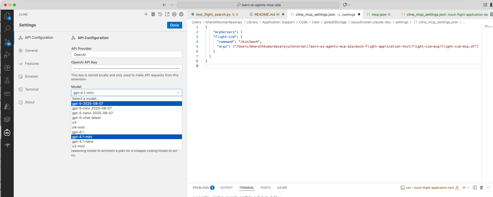
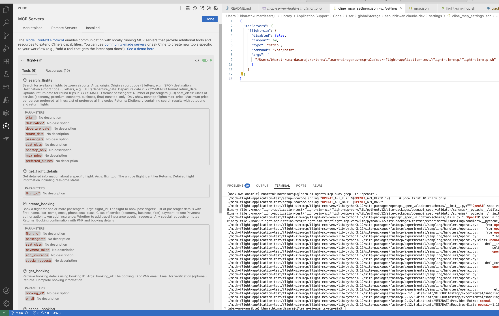
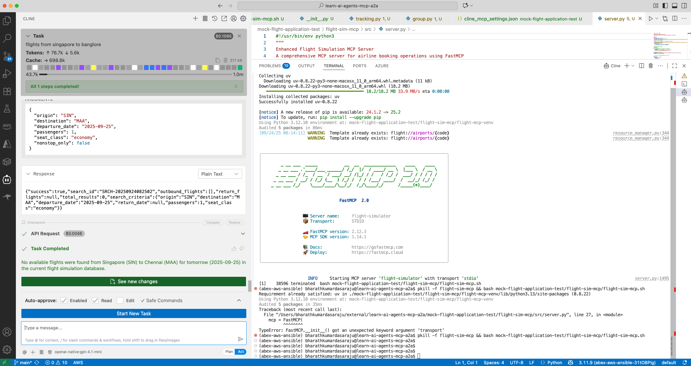

# learn-ai-agents-mcp-a2a
learn-ai-agents-mcp-a2a

## What is Model Context Protocol (MCP)?

A protocol or interface that defines how information (context) is structured, sent, and used when interacting with an AI model - especially multi-turn, tool-using, or agent-like systems.

Modern AI models need context to do intelligent reasoning. MCP helps organize this context in a structured, extensible way:

- What was previously said? (conversation history)  
- What tools are available? (tool/function metadata)  
- What actions were taken? (and their outputs)  
- What the model is expected to do next?  

Using **Cline** with an MCP server, we can get a structured AI agent that can:  
- Reason step-by-step  
- Use tools  
- Remember context  
- Be inspected, versioned, and improved  

---

### Env Setup and API Keys
```bash
bharathkumardasaraju@mock-flight-application-test$ python3.12 -m venv venv
bharathkumardasaraju@mock-flight-application-test$ 
~ ➜  env | grep -i API
OPENAI_API_KEY=OPENAI_API_KEY="sk-proj-IDABCDEFGHIJKLMNOP-123456789123456789-JNusQUA"
OPENAI_API_BASE=https://api.openai.com/v1
```
### configure openapi keys in cline 
- config api-keys for openai in cline



### Configure local-MCP-Server in the vscode
-  Configure local MCP-Server



### test mcp-server running locally used by openAPI via cline
- search flights from SG to MAA tomrrow in the cline 

